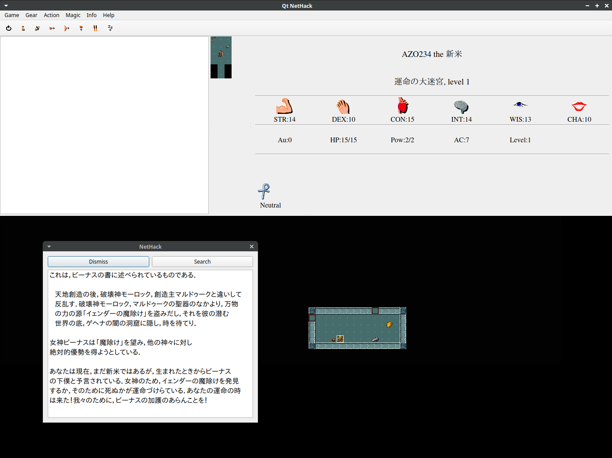

# JNetHackインストーラ



ローグライクの始祖、『NetHack』の体験を！

JNetHack 32x32 Qt版をインストールするバッチスクリプトです。
[JNetHack 3.6.7-0.1](https://jnethack.github.io/)を基に、UTF-8とQtの修正を加えたものです。

## 環境

- Ubuntu + Qt + ビルド環境

``` bash
$ sudo apt install build-essential patch qt6-base-dev qt6-base-dev-tools 
```

## 使い方

clone して実行して下さい。
ユーザーの`nh`ディレクトリにインストールされます。
`desktop`ファイルなども入ります。

``` bash
$ git clone https://github.com/AZO234/JNetHack-UTF8-Qt-Fix.git
$ cd JNetHack-UTF8-Qt-Fix
$ ./JNetHack.sh
```

## 補足

`misc/tile.bmp` は、[NetHack Wiki](https://nethackwiki.com/images/4/4b/X11tiles-32-32.png) のPNG画像をBMP画像に変換したものです。
~~このためだけに変換ツール＆コマンドの解説を書きたくない。~~

## ライセンス

GPL-3.0
